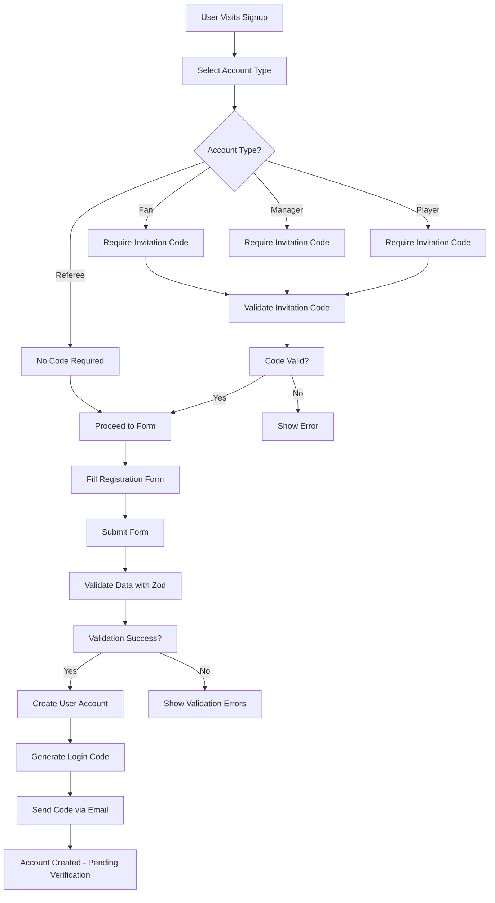
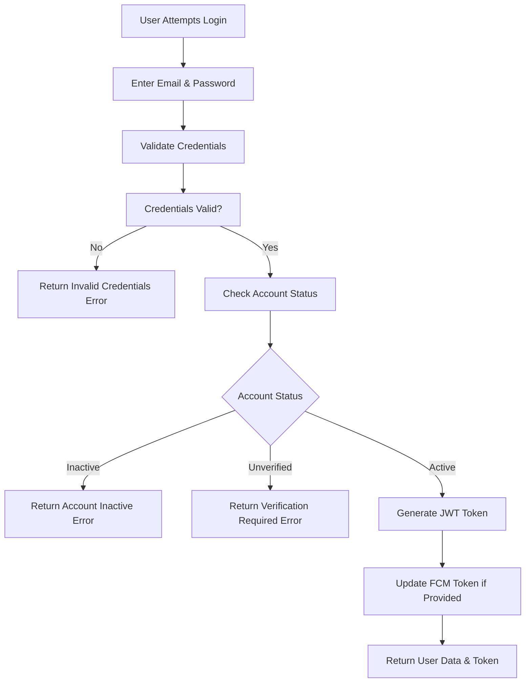
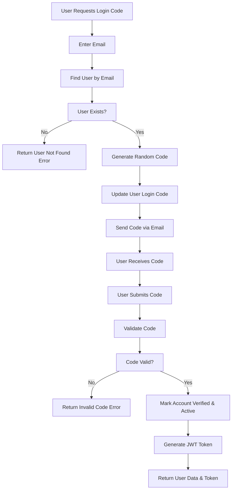

# Authentication & Authorization System

## Overview

The Futy League Management System implements a comprehensive authentication and authorization system supporting multiple user roles with secure JWT-based session management, multi-step registration workflows, and role-based access control (RBAC).

## Authentication Architecture

### Supported User Roles

- **Player**: Team member with invitation-based registration
- **Manager**: Team administrator with full team management capabilities
- **Fan**: Supporter with limited access to team activities
- **Referee**: Match official with specialized referee features
- **Admin**: System administrator with full platform access

### Authentication Methods

#### 1. Email & Password Authentication
- Standard email/password login with bcrypt hashing
- Account verification via email codes
- Password reset functionality

#### 2. Invitation Code System
- **Player Invitations**: Manager-created codes for team recruitment
- **Fan Invitations**: Manager-created codes for fan engagement
- **Manager Invitations**: Admin-created codes for team management

#### 3. Code-Based Verification
- Email verification codes for account activation
- Login codes for passwordless authentication
- OTP system for password recovery

## Authentication Flow

### User Registration Process



### Login Process



### Code-Based Login Flow



## Authorization System

### JWT Token Structure

```json
{
  "header": {
    "alg": "HS256",
    "typ": "JWT"
  },
  "payload": {
    "email": "user@example.com",
    "user_id": "64f1a2b3c4d5e6f7g8h9i0j1",
    "role": "Player",
    "iat": 1640995200,
    "exp": 1641081600
  },
  "signature": "base64-encoded-signature"
}
```

### Route Protection Middleware

```javascript
// lib/auth/middleware.js
export async function protectApiRoute(req) {
  try {
    const token = req.cookies.get('auth-token')?.value;

    if (!token) {
      return NextResponse.json(
        { success: false, message: 'Authentication required' },
        { status: 401 }
      );
    }

    const decoded = jwt.verify(token, process.env.JWT_SECRET);
    const user = await User.findById(decoded.user_id);

    if (!user || !user.isActive) {
      return NextResponse.json(
        { success: false, message: 'Invalid or inactive user' },
        { status: 401 }
      );
    }

    return { user };
  } catch (error) {
    return NextResponse.json(
      { success: false, message: 'Invalid token' },
      { status: 401 }
    );
  }
}
```

### Role-Based Access Control (RBAC)

#### Permission Matrix

| Feature | Player | Manager | Fan | Referee | Admin |
|---------|--------|---------|-----|---------|-------|
| View Profile | ✅ | ✅ | ✅ | ✅ | ✅ |
| Edit Profile | ✅ | ✅ | ✅ | ✅ | ✅ |
| Join Team | ✅ | ❌ | ❌ | ❌ | ✅ |
| Create Team | ❌ | ✅ | ❌ | ❌ | ✅ |
| Manage Team | ❌ | ✅ | ❌ | ❌ | ✅ |
| Create Tournament | ❌ | ✅ | ❌ | ❌ | ✅ |
| Accept Tournament | ❌ | ❌ | ❌ | ✅ | ✅ |
| View Store | ✅ | ✅ | ✅ | ✅ | ✅ |
| Purchase Items | ✅ | ✅ | ✅ | ✅ | ✅ |
| Admin Panel | ❌ | ❌ | ❌ | ❌ | ✅ |
| System Settings | ❌ | ❌ | ❌ | ❌ | ✅ |

## Security Features

### Password Security
- **Hashing**: bcrypt with configurable rounds (default: 12)
- **Minimum Requirements**: 7 characters, confirmation matching
- **Reset Mechanism**: OTP-based password recovery

### Token Security
- **HTTP-Only Cookies**: Prevent XSS attacks
- **Expiration**: Configurable token lifetime (default: 7 days)
- **Refresh Mechanism**: Token renewal without re-authentication

### Input Validation
- **Zod Schemas**: Comprehensive client and server-side validation
- **Sanitization**: Input cleaning and XSS prevention
- **Rate Limiting**: Request throttling to prevent abuse

### Session Management
- **Secure Cookies**: HttpOnly, Secure, SameSite flags
- **FCM Integration**: Push notification token management
- **Device Tracking**: Optional multi-device support

## API Authentication Endpoints

### User Registration
```http
POST /api/users/signup
Content-Type: application/json

{
  "email": "user@example.com",
  "password": "securepassword123",
  "confirm_password": "securepassword123",
  "name": "John Doe",
  "telephone": "+1234567890",
  "account_type": "Player",
  "invitation_code": "ABC123XYZ"
}
```

### User Login
```http
POST /api/users/login
Content-Type: application/json

{
  "email": "user@example.com",
  "password": "securepassword123",
  "fcmtoken": "optional-fcm-token"
}
```

### Code-Based Login
```http
POST /api/users/loginbycode
Content-Type: application/json

{
  "login_code": "123456"
}
```

### Password Reset
```http
POST /api/users/forgetpassword
Content-Type: application/json

{
  "email": "user@example.com"
}
```

### Code Resend
```http
POST /api/users/resendcode
Content-Type: application/json

{
  "email": "user@example.com"
}
```

## Invitation Code System

### Player Invitations
```javascript
// Manager creates invitation
const invitation = await PlayerInvitation.create({
  player_email: 'player@example.com',
  player_name: 'John Doe',
  player_invitation_code: 'AUTO_GENERATED_CODE',
  manager_id: managerId,
  team_id: teamId
});
```

### Invitation Validation
```javascript
// During signup
const existing = await PlayerInvitation.findOne({
  player_email: email,
  player_invitation_code: code
});

if (!existing) {
  throw new Error('Invalid invitation code');
}
```

## Error Handling

### Authentication Errors

| Error Code | Message | HTTP Status |
|------------|---------|-------------|
| AUTH_001 | Authentication required | 401 |
| AUTH_002 | Invalid credentials | 401 |
| AUTH_003 | Account inactive | 403 |
| AUTH_004 | Account unverified | 403 |
| AUTH_005 | Invalid token | 401 |
| AUTH_006 | Token expired | 401 |
| AUTH_007 | Insufficient permissions | 403 |

### Validation Errors

```json
{
  "success": false,
  "message": {
    "email": "Invalid email format",
    "password": "Password must be at least 7 characters",
    "invitation_code": "Invitation code is required for Player accounts"
  }
}
```

## Security Best Practices

### Password Policies
- Minimum 7 characters
- Mixed case recommended
- Special characters allowed
- No common passwords

### Token Management
- Short-lived access tokens
- Secure refresh token rotation
- Automatic logout on suspicious activity

### Rate Limiting
- Login attempts: 5 per 15 minutes
- API requests: 100 per 15 minutes per user
- Password reset: 3 per hour per email

### Audit Logging
- All authentication events logged
- Failed login attempts tracked
- Suspicious activity monitoring

## Testing Authentication

### Unit Tests
```javascript
// Test JWT token generation
describe('JWT Token Generation', () => {
  test('should generate valid token', () => {
    const token = generateToken({ userId: '123', email: 'test@example.com' });
    expect(token).toBeDefined();
  });
});

// Test password hashing
describe('Password Hashing', () => {
  test('should hash password securely', async () => {
    const hash = await hashPassword('password123');
    expect(hash).not.toBe('password123');
  });
});
```

### Integration Tests
```javascript
// Test complete login flow
describe('Login Flow', () => {
  test('should authenticate user successfully', async () => {
    const response = await request(app)
      .post('/api/users/login')
      .send({
        email: 'user@example.com',
        password: 'password123'
      });

    expect(response.status).toBe(200);
    expect(response.body.success).toBe(true);
    expect(response.body.token).toBeDefined();
  });
});
```

## Monitoring & Maintenance

### Authentication Metrics
- Login success/failure rates
- Registration completion rates
- Token expiration statistics
- Security incident tracking

### Maintenance Tasks
- Regular token cleanup
- Expired invitation removal
- Inactive account management
- Security audit logging review

This authentication system provides a robust, secure foundation for the Futy League Management platform, supporting multiple user types with comprehensive security measures and user-friendly workflows.