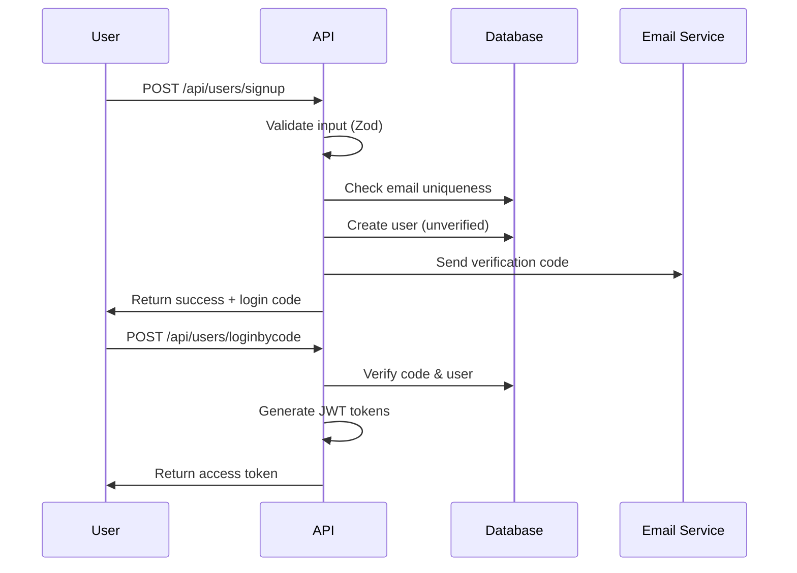

# Security & Authentication System

## Overview

The Futy League Management System implements a comprehensive security architecture with multi-layered protection, JWT-based authentication, role-based access control (RBAC), and enterprise-grade security measures. This document details the security implementation, authentication flows, and best practices.

## Authentication Architecture

### JWT-Based Authentication System

The system uses JSON Web Tokens (JWT) for stateless authentication with the following components:

```javascript
// JWT Token Structure
{
  "header": {
    "alg": "HS256",
    "typ": "JWT"
  },
  "payload": {
    "userId": "user_id",
    "email": "user@example.com",
    "role": "Player|Manager|Fan|Referee",
    "permissions": ["read:profile", "write:tournament"],
    "iat": 1640995200,
    "exp": 1641081600,
    "iss": "futy-league-management",
    "aud": "futy-league-users"
  },
  "signature": "HMACSHA256(base64UrlEncode(header) + '.' + base64UrlEncode(payload), secret)"
}
```

### Authentication Flow

#### User Registration & Verification



#### Token-Based Authentication

```javascript
// Access Token Flow
const authenticateRequest = async (req) => {
  const token = req.headers.authorization?.replace('Bearer ', '');

  if (!token) {
    throw new AuthenticationError('No token provided');
  }

  try {
    const decoded = jwt.verify(token, process.env.JWT_SECRET);
    const user = await User.findById(decoded.userId);

    if (!user || !user.isActive) {
      throw new AuthenticationError('Invalid user');
    }

    req.user = user;
    return user;
  } catch (error) {
    throw new AuthenticationError('Invalid token');
  }
};
```

### Multi-Factor Authentication (Future Enhancement)

The system is designed to support MFA with the following structure:

```javascript
// MFA Implementation Structure
const mfaConfig = {
  enabled: true,
  methods: ['email', 'sms', 'authenticator'],
  requiredForRoles: ['Manager', 'Referee']
};

const verifyMFA = async (userId, mfaToken) => {
  // Verify MFA token against user's MFA method
  const user = await User.findById(userId);
  const isValid = await verifyMFAToken(user.mfaSecret, mfaToken);

  if (!isValid) {
    await logSecurityEvent('MFA_FAILED', { userId });
    throw new AuthenticationError('Invalid MFA token');
  }

  return true;
};
```

## Role-Based Access Control (RBAC)

### User Roles & Permissions

The system implements hierarchical role-based permissions:

```javascript
// Role Hierarchy
const USER_ROLES = {
  FAN: 'Fan',
  PLAYER: 'Player',
  MANAGER: 'Manager',
  REFEREE: 'Referee',
  ADMIN: 'Admin'
};

// Permission Matrix
const ROLE_PERMISSIONS = {
  [USER_ROLES.FAN]: [
    'read:public_content',
    'read:tournaments',
    'create:fan_profile',
    'update:own_profile'
  ],
  [USER_ROLES.PLAYER]: [
    'read:public_content',
    'read:tournaments',
    'join:tournaments',
    'create:player_profile',
    'update:own_profile',
    'read:team_info'
  ],
  [USER_ROLES.MANAGER]: [
    'read:public_content',
    'read:tournaments',
    'create:tournaments',
    'manage:own_teams',
    'invite:players',
    'update:team_profile',
    'read:player_profiles'
  ],
  [USER_ROLES.REFEREE]: [
    'read:public_content',
    'read:tournaments',
    'accept:referee_requests',
    'update:referee_profile',
    'view:match_details'
  ],
  [USER_ROLES.ADMIN]: [
    'admin:*',  // Full administrative access
    'system:manage',
    'users:manage',
    'content:moderate'
  ]
};
```

### Permission Checking Middleware

```javascript
// Permission Middleware
export const requirePermission = (permission) => {
  return async (req, res, next) => {
    try {
      const user = req.user;

      if (!user) {
        return res.status(401).json({
          success: false,
          message: 'Authentication required'
        });
      }

      const userPermissions = await getUserPermissions(user._id);

      if (!hasPermission(userPermissions, permission)) {
        await logSecurityEvent('PERMISSION_DENIED', {
          userId: user._id,
          permission,
          endpoint: req.path
        });

        return res.status(403).json({
          success: false,
          message: 'Insufficient permissions'
        });
      }

      next();
    } catch (error) {
      next(error);
    }
  };
};

// Usage in routes
app.get('/api/admin/users',
  authenticate,
  requirePermission('admin:users:read'),
  getUsers
);
```

## Security Middleware

### Request Validation & Sanitization

```javascript
// Input Validation Middleware
import { z } from 'zod';

const userInputSchema = z.object({
  email: z.string().email().toLowerCase().trim(),
  password: z.string().min(7).max(100),
  name: z.string().min(2).max(50).trim(),
  telephone: z.string().regex(/^\+?[\d\s\-\(\)]+$/)
});

export const validateInput = (schema) => {
  return async (req, res, next) => {
    try {
      req.body = schema.parse(req.body);
      next();
    } catch (error) {
      return res.status(422).json({
        success: false,
        message: 'Validation failed',
        errors: error.errors
      });
    }
  };
};
```

### Rate Limiting

```javascript
// Rate Limiting Configuration
import rateLimit from 'express-rate-limit';

const authLimiter = rateLimit({
  windowMs: 15 * 60 * 1000, // 15 minutes
  max: 5, // 5 attempts per window
  message: {
    success: false,
    message: 'Too many authentication attempts, please try again later'
  },
  standardHeaders: true,
  legacyHeaders: false,
  handler: (req, res) => {
    logSecurityEvent('RATE_LIMIT_EXCEEDED', {
      ip: req.ip,
      endpoint: req.path
    });
    res.status(429).json({
      success: false,
      message: 'Too many requests, please try again later'
    });
  }
});

const apiLimiter = rateLimit({
  windowMs: 15 * 60 * 1000, // 15 minutes
  max: 100, // 100 requests per window
  message: 'API rate limit exceeded'
});
```

### CORS Configuration

```javascript
// CORS Security Configuration
const corsOptions = {
  origin: function (origin, callback) {
    const allowedOrigins = process.env.CORS_ORIGIN?.split(',') || [];

    // Allow requests with no origin (mobile apps, etc.)
    if (!origin) return callback(null, true);

    if (allowedOrigins.includes(origin)) {
      callback(null, true);
    } else {
      logSecurityEvent('CORS_BLOCKED', { origin });
      callback(new Error('Not allowed by CORS'));
    }
  },
  credentials: true,
  methods: ['GET', 'POST', 'PUT', 'DELETE', 'OPTIONS'],
  allowedHeaders: ['Content-Type', 'Authorization', 'X-Requested-With'],
  exposedHeaders: ['X-Total-Count', 'X-Rate-Limit-Remaining'],
  maxAge: 86400 // 24 hours
};
```

## Data Protection

### Password Security

```javascript
// Password Hashing & Verification
import bcrypt from 'bcrypt';

const PASSWORD_CONFIG = {
  minLength: 7,
  requireUppercase: true,
  requireLowercase: true,
  requireNumbers: true,
  requireSymbols: false,
  bcryptRounds: 12
};

export const hashPassword = async (password) => {
  const salt = await bcrypt.genSalt(PASSWORD_CONFIG.bcryptRounds);
  return bcrypt.hash(password, salt);
};

export const verifyPassword = async (password, hash) => {
  return bcrypt.compare(password, hash);
};

// Password Strength Validation
export const validatePasswordStrength = (password) => {
  const errors = [];

  if (password.length < PASSWORD_CONFIG.minLength) {
    errors.push(`Password must be at least ${PASSWORD_CONFIG.minLength} characters`);
  }

  if (PASSWORD_CONFIG.requireUppercase && !/[A-Z]/.test(password)) {
    errors.push('Password must contain at least one uppercase letter');
  }

  if (PASSWORD_CONFIG.requireLowercase && !/[a-z]/.test(password)) {
    errors.push('Password must contain at least one lowercase letter');
  }

  if (PASSWORD_CONFIG.requireNumbers && !/\d/.test(password)) {
    errors.push('Password must contain at least one number');
  }

  if (PASSWORD_CONFIG.requireSymbols && !/[!@#$%^&*()_+\-=\[\]{};':"\\|,.<>\/?]/.test(password)) {
    errors.push('Password must contain at least one special character');
  }

  return errors;
};
```

### Data Encryption

```javascript
// Sensitive Data Encryption
import crypto from 'crypto';

const ENCRYPTION_KEY = process.env.ENCRYPTION_KEY; // 32 bytes
const ALGORITHM = 'aes-256-gcm';

export const encrypt = (text) => {
  const iv = crypto.randomBytes(16);
  const cipher = crypto.createCipher(ALGORITHM, ENCRYPTION_KEY);

  let encrypted = cipher.update(text, 'utf8', 'hex');
  encrypted += cipher.final('hex');

  const authTag = cipher.getAuthTag();

  return {
    encrypted,
    iv: iv.toString('hex'),
    authTag: authTag.toString('hex')
  };
};

export const decrypt = (encryptedData) => {
  const decipher = crypto.createDecipher(ALGORITHM, ENCRYPTION_KEY);
  decipher.setAuthTag(Buffer.from(encryptedData.authTag, 'hex'));

  let decrypted = decipher.update(encryptedData.encrypted, 'hex', 'utf8');
  decrypted += decipher.final('utf8');

  return decrypted;
};
```

### File Upload Security

```javascript
// Secure File Upload Configuration
const multerConfig = {
  limits: {
    fileSize: 10 * 1024 * 1024, // 10MB
    files: 5 // Maximum 5 files
  },
  fileFilter: (req, file, cb) => {
    const allowedTypes = /jpeg|jpg|png|gif|pdf/;
    const extname = allowedTypes.test(path.extname(file.originalname).toLowerCase());
    const mimetype = allowedTypes.test(file.mimetype);

    if (mimetype && extname) {
      return cb(null, true);
    } else {
      logSecurityEvent('INVALID_FILE_TYPE', {
        filename: file.originalname,
        mimetype: file.mimetype
      });
      cb(new Error('Invalid file type'));
    }
  },
  storage: multer.diskStorage({
    destination: (req, file, cb) => {
      const uploadDir = path.join(process.cwd(), 'uploads', 'temp');
      cb(null, uploadDir);
    },
    filename: (req, file, cb) => {
      // Generate secure filename
      const uniqueName = crypto.randomUUID() + path.extname(file.originalname);
      cb(null, uniqueName);
    }
  })
};
```

## Security Monitoring & Auditing

### Security Event Logging

```javascript
// Security Event Logger
const SECURITY_EVENTS = {
  LOGIN_SUCCESS: 'LOGIN_SUCCESS',
  LOGIN_FAILED: 'LOGIN_FAILED',
  PASSWORD_RESET: 'PASSWORD_RESET',
  PERMISSION_DENIED: 'PERMISSION_DENIED',
  RATE_LIMIT_EXCEEDED: 'RATE_LIMIT_EXCEEDED',
  SUSPICIOUS_ACTIVITY: 'SUSPICIOUS_ACTIVITY',
  INVALID_TOKEN: 'INVALID_TOKEN'
};

export const logSecurityEvent = async (eventType, data) => {
  const event = {
    eventType,
    timestamp: new Date(),
    ip: data.ip || 'unknown',
    userAgent: data.userAgent || 'unknown',
    userId: data.userId || null,
    details: data,
    severity: getEventSeverity(eventType)
  };

  // Log to database
  await SecurityLog.create(event);

  // Send to monitoring service if critical
  if (event.severity === 'critical') {
    await sendToMonitoring(event);
  }

  // Alert administrators for high-severity events
  if (['critical', 'high'].includes(event.severity)) {
    await alertAdministrators(event);
  }
};
```

### Intrusion Detection

```javascript
// Basic Intrusion Detection
const intrusionDetection = {
  failedLoginThreshold: 5,
  timeWindow: 15 * 60 * 1000, // 15 minutes
  blockDuration: 60 * 60 * 1000 // 1 hour
};

export const checkIntrusion = async (ip, userId) => {
  const recentFailures = await SecurityLog.countDocuments({
    ip,
    eventType: 'LOGIN_FAILED',
    timestamp: { $gte: new Date(Date.now() - intrusionDetection.timeWindow) }
  });

  if (recentFailures >= intrusionDetection.failedLoginThreshold) {
    // Block IP temporarily
    await Blocklist.create({
      ip,
      reason: 'Brute force attempt',
      expiresAt: new Date(Date.now() + intrusionDetection.blockDuration)
    });

    logSecurityEvent('IP_BLOCKED', { ip, reason: 'Brute force protection' });
    return true; // Blocked
  }

  return false; // Not blocked
};
```

## API Security

### Request Signing (Optional)

```javascript
// API Request Signing for Mobile Apps
export const verifyRequestSignature = (req) => {
  const signature = req.headers['x-signature'];
  const timestamp = req.headers['x-timestamp'];
  const body = JSON.stringify(req.body);

  // Check timestamp (prevent replay attacks)
  const now = Date.now();
  const requestTime = parseInt(timestamp);
  if (Math.abs(now - requestTime) > 5 * 60 * 1000) { // 5 minutes
    throw new Error('Request timestamp expired');
  }

  // Verify signature
  const expectedSignature = crypto
    .createHmac('sha256', process.env.API_SECRET)
    .update(`${timestamp}.${body}`)
    .digest('hex');

  if (signature !== expectedSignature) {
    throw new Error('Invalid request signature');
  }

  return true;
};
```

### API Key Management

```javascript
// API Key Authentication for Third Parties
export const authenticateApiKey = async (apiKey) => {
  const key = await ApiKey.findOne({
    key: apiKey,
    isActive: true,
    expiresAt: { $gt: new Date() }
  });

  if (!key) {
    throw new AuthenticationError('Invalid API key');
  }

  // Check rate limits
  const usage = await getApiKeyUsage(key._id);
  if (usage >= key.rateLimit) {
    throw new Error('API key rate limit exceeded');
  }

  // Update usage
  await incrementApiKeyUsage(key._id);

  return key;
};
```

## Security Headers

### HTTP Security Headers Middleware

```javascript
// Security Headers Configuration
export const securityHeaders = (req, res, next) => {
  // Prevent clickjacking
  res.setHeader('X-Frame-Options', 'DENY');

  // Prevent MIME type sniffing
  res.setHeader('X-Content-Type-Options', 'nosniff');

  // Enable XSS protection
  res.setHeader('X-XSS-Protection', '1; mode=block');

  // Referrer policy
  res.setHeader('Referrer-Policy', 'strict-origin-when-cross-origin');

  // Content Security Policy
  res.setHeader('Content-Security-Policy',
    "default-src 'self'; " +
    "script-src 'self' 'unsafe-inline'; " +
    "style-src 'self' 'unsafe-inline'; " +
    "img-src 'self' data: https:; " +
    "font-src 'self'; " +
    "connect-src 'self' https://api.futy-league.com"
  );

  // HSTS (HTTP Strict Transport Security)
  if (process.env.NODE_ENV === 'production') {
    res.setHeader('Strict-Transport-Security',
      'max-age=31536000; includeSubDomains; preload'
    );
  }

  next();
};
```

## Database Security

### Query Sanitization

```javascript
// MongoDB Query Sanitization
export const sanitizeQuery = (query) => {
  const sanitized = {};

  for (const [key, value] of Object.entries(query)) {
    // Prevent NoSQL injection
    if (typeof value === 'string') {
      // Remove potential MongoDB operators
      sanitized[key] = value.replace(/[\$]/g, '');
    } else if (typeof value === 'object' && value !== null) {
      // Recursively sanitize nested objects
      sanitized[key] = sanitizeQuery(value);
    } else {
      sanitized[key] = value;
    }
  }

  return sanitized;
};
```

### Database Encryption

```javascript
// Field-level encryption for sensitive data
const sensitiveFields = ['password', 'email', 'phone', 'paymentInfo'];

export const encryptSensitiveFields = (data) => {
  const encrypted = { ...data };

  sensitiveFields.forEach(field => {
    if (encrypted[field]) {
      encrypted[field] = encrypt(encrypted[field]);
    }
  });

  return encrypted;
};

export const decryptSensitiveFields = (data) => {
  const decrypted = { ...data };

  sensitiveFields.forEach(field => {
    if (decrypted[field] && typeof decrypted[field] === 'object') {
      try {
        decrypted[field] = decrypt(decrypted[field]);
      } catch (error) {
        // Handle decryption errors
        console.error(`Failed to decrypt ${field}:`, error);
      }
    }
  });

  return decrypted;
};
```

## Security Testing

### Automated Security Testing

```javascript
// Security Test Suite
describe('Security Tests', () => {
  test('should prevent SQL injection', async () => {
    const maliciousInput = "'; DROP TABLE users; --";
    const result = await api.post('/api/users/search', { query: maliciousInput });

    expect(result.status).toBe(200); // Should sanitize input
    expect(result.data.users).toBeDefined(); // Should not crash
  });

  test('should enforce password requirements', async () => {
    const weakPasswords = ['123', 'password', 'weak'];

    for (const password of weakPasswords) {
      const result = await api.post('/api/users/signup', {
        email: 'test@example.com',
        password,
        name: 'Test User'
      });

      expect(result.status).toBe(422);
      expect(result.data.message).toContain('password');
    }
  });

  test('should prevent unauthorized access', async () => {
    const result = await api.get('/api/admin/users');

    expect(result.status).toBe(401); // Should require authentication
  });
});
```

### Penetration Testing Checklist

- [ ] Authentication bypass attempts
- [ ] Authorization testing (horizontal/vertical privilege escalation)
- [ ] Input validation testing (XSS, SQL injection, command injection)
- [ ] Session management testing
- [ ] File upload vulnerability testing
- [ ] API security testing
- [ ] Rate limiting effectiveness
- [ ] SSL/TLS configuration
- [ ] Security headers verification

## Incident Response

### Security Incident Handling

```javascript
// Incident Response Workflow
const handleSecurityIncident = async (incident) => {
  // 1. Log the incident
  await logSecurityEvent('SECURITY_INCIDENT', incident);

  // 2. Assess severity
  const severity = assessIncidentSeverity(incident);

  // 3. Contain the threat
  await containThreat(incident);

  // 4. Notify stakeholders
  await notifyStakeholders(incident, severity);

  // 5. Investigate and remediate
  await investigateIncident(incident);

  // 6. Document and learn
  await documentIncident(incident);
};
```

### Breach Notification

```javascript
// GDPR-compliant breach notification
const notifyDataBreach = async (affectedUsers, breachDetails) => {
  const notification = {
    subject: 'Security Incident Notification',
    recipients: affectedUsers,
    content: {
      incident: 'Unauthorized access detected',
      whatHappened: 'Brief description of the incident',
      whatInfo: 'Types of data potentially affected',
      whatWereDoing: 'Steps taken to resolve',
      whatYouCanDo: 'Recommended actions for users'
    },
    timestamp: new Date(),
    compliance: 'GDPR Article 34'
  };

  await sendBreachNotifications(notification);
  await logComplianceEvent('BREACH_NOTIFICATION_SENT', notification);
};
```

## Compliance & Standards

### GDPR Compliance

- **Data Protection**: Encryption of personal data at rest and in transit
- **Consent Management**: Explicit user consent for data processing
- **Right to Erasure**: Complete data deletion capabilities
- **Data Portability**: User data export functionality
- **Breach Notification**: Automated breach detection and notification

### Security Standards

- **OWASP Top 10**: Implementation of OWASP security guidelines
- **JWT RFC 7519**: Standards-compliant JWT implementation
- **bcrypt**: Industry-standard password hashing
- **HTTPS Everywhere**: SSL/TLS encryption for all communications

## Performance & Security Balance

### Security-Performance Optimization

```javascript
// Cached Permission Checks
const permissionCache = new Map();
const CACHE_TTL = 5 * 60 * 1000; // 5 minutes

export const getCachedPermissions = async (userId) => {
  const cacheKey = `permissions:${userId}`;
  const cached = permissionCache.get(cacheKey);

  if (cached && Date.now() - cached.timestamp < CACHE_TTL) {
    return cached.permissions;
  }

  const permissions = await getUserPermissions(userId);
  permissionCache.set(cacheKey, {
    permissions,
    timestamp: Date.now()
  });

  return permissions;
};
```

## Monitoring & Alerting

### Security Dashboard

```javascript
// Security Metrics Collection
const collectSecurityMetrics = async () => {
  const metrics = {
    activeUsers: await User.countDocuments({ lastLogin: { $gte: new Date(Date.now() - 24 * 60 * 60 * 1000) } }),
    failedLogins: await SecurityLog.countDocuments({
      eventType: 'LOGIN_FAILED',
      timestamp: { $gte: new Date(Date.now() - 60 * 60 * 1000) }
    }),
    blockedIPs: await Blocklist.countDocuments({ expiresAt: { $gt: new Date() } }),
    activeSessions: await Session.countDocuments({ expiresAt: { $gt: new Date() } })
  };

  await sendMetricsToDashboard(metrics);
  return metrics;
};
```

This comprehensive security system ensures the Futy League Management platform maintains enterprise-grade security while providing a smooth user experience. Regular security audits, penetration testing, and continuous monitoring help maintain the highest security standards.